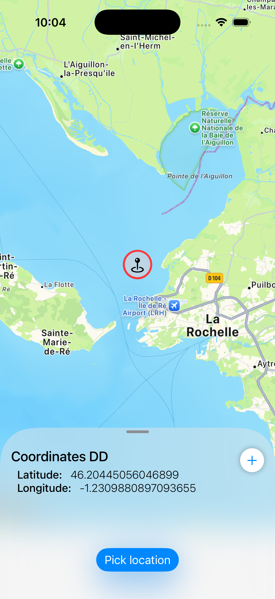
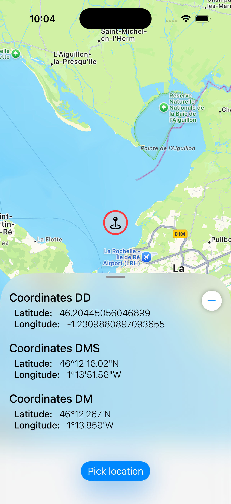

# SheetOverlay


## Quickly said

A SwiftUI bottom sheet that doesn’t block interaction with the content behind it.

## Description

SheetOverlay is a SwiftUI package that presents bottom sheets as overlays instead of modal sheets. 
Unlike SwiftUI’s standard .sheet, it allows users to continue interacting with the underlying content while the sheet is visible. The sheet supports configurable detents and programmatic control, making it ideal for map-style interfaces and other layouts where background interaction is required.


<p align="center">
  
  
  
</p>


## Installation

### Swift Package Manager

In Xcode: **File → Add Package Dependencies**

```
https://github.com/BaptisteSansierra/SheetOverlay
```

Or in `Package.swift`:

```swift
dependencies: [
    .package(url: "https://github.com/BaptisteSansierra/SheetOverlay", from: "1.0.0")
]
```

---

## Basic usage

```swift
import SheetOverlay

.sheetOverlay(isPresented: $isPresented) {
    MySheetContent()
}
```

---

## Full API

```swift
.sheetOverlay(isPresented: $isPresented, selected: $currentDetent) {
    contentView
        .sheetOverlayDetents([.height(250), .medium, .large])
        .sheetOverlayCornerRadius(50)
        .sheetOverlayDragIndicator(.visible)
        .sheetOverlayBackground(.ultraThinMaterial)
        .sheetOverlayShadow(color: .black.opacity(0.2), radius: 8, x: 0, y: -2)
}
```

### Parameters

| Parameter | Type | Description |
|---|---|---|
| `isPresented` | `Binding<Bool>` | Controls sheet visibility |
| `selected` | `Binding<SheetOverlayDetent>?` | Tracks and controls the current detent. Optional. |

### Content modifiers

| Modifier | Description |
|---|---|
| `.sheetOverlayDetents([...])` | Sets the available detent stops |
| `.sheetOverlayBackground(style)` | Any `ShapeStyle` — colors, materials, gradients |
| `.sheetOverlayCornerRadius(_:)` | Corner radius for the sheet top edge |
| `.sheetOverlayDragIndicator(_:)` | `.automatic`, `.visible` or `.hidden` |
| `.sheetOverlayShadow(color:radius:x:y:)` | Shadow on the sheet container |
| `.sheetOverlayHideShadow()` | Hide the default shadow |
---

## Detents

```swift
.sheetOverlayDetents([
    .height(250),   // fixed height in points
    .medium,        // 50% of screen height
    .large,         // almost full screen height 
    .fraction(0.3), // 30% of screen height
])
```

Detents are **automatically sorted** and deduplicated. The sheet snaps to the nearest detent after dragging.

---

## Controlling detent externally

Pass a `selected` binding to read or set the current detent from outside the sheet:

```swift
@State var currentDetent: SheetOverlayDetent = .medium

// Programmatically change detent
Button("Expand") {
    currentDetent = .large
}

// Sheet reflects the change
.sheetOverlay(isPresented: $isPresented, selected: $currentDetent) {
    content.sheetOverlayDetents([.medium, .large])
}
```

The selected value is ignored if it's part of provided detents (`sheetOverlayDetents` array).

---

## Background

Accepts any SwiftUI `ShapeStyle`:

```swift
.sheetOverlayBackground(.thinMaterial)        // default
.sheetOverlayBackground(Color.white)
.sheetOverlayBackground(
    LinearGradient(colors: [.blue, .purple],
                   startPoint: .top,
                   endPoint: .bottom)
)
```

---

## How it works

`SheetOverlay` renders sheet content in a secondary `UIWindow` positioned above the app's main window:

```
UIWindowScene
  ├── Main UIWindow          (your app, navigation bar, tab bar)
  └── SheetOverlayWindow (UIWindow with windowLevel: .normal + 1)
        └── UIHostingController<SheetOverlayView>
```

---

## Comparison

| Feature | `.sheet` | `.sheetOverlay` |
|---|---|---|
| Parent view interactive | ❌ | ✅ |
| Multiple detents | ✅ | ✅ |
| Custom background | ✅ | ✅ |
| Drag to dismiss | ✅ | ✅ |
| External detent control | ✅ | ✅ |
| ScrollView coordination | ✅ | ⚠️ In progress |

---

## Requirements

- iOS 17+
- Swift 5.9+
- Xcode 15+

---

## License

MIT
